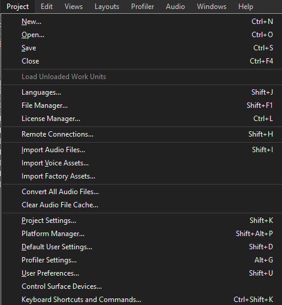
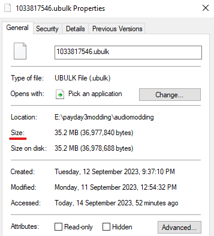

# Custom Music

## Prerequisites
:::note
You do not require Unreal Engine to be installed to replace the game's audio
:::
 - Wwise 2021.1.13.8036 **or** [wwise_pd3](https://github.com/MoolahModding/wwise_pd3/releases/latest)
 - A program that can extract UE4 PAK files (FModel, UModel)
 - A program that can pack UE4 PAK files (repak, UnrealPak)
 - Bence's Uexp Utility, to edit the uexp to have the right size: https://github.com/bence0585/Bences-uexp-utility

## Setting up your sound files
In order for Wwise and wwise_pd3 to work properly, your files must be
in the WAV format with PCM encoding. The best way to do this is to use
a tool like ffmpeg to encode your audio to little endian 16-bit.

An example command for this is `ffmpeg -i input.wav/mp3 -c:a pcm_s16le output.wav`

## Encoding your files for PAYDAY 3

### Using Wwise
1. Make sure you have a Wwise project made for converting all
your audio files.

:::warning
Your Wwise project must have its Conversion Settings set to `PCM Auto Detect High`
before you import any files. Or they will not play in PAYDAY 3.

You can set this by opening the project settings (Project->Project Settings),
going to the Source Settings tab. Pressing the 3 dots next to the
currently set conversion setting and selecting
`Factory Conversion Settings -> PCM -> PCM Auto Detect High`
:::

2. Import your audio files using the "Import Audio Files..." option in the project menu or
use Shift+I when in the project.

3. Once you open the audio importer, you will need add your files using
the "Add Files..." button.

4. Once you've selected your files, press the "Import" button and wait
for it to finish importing.
5. Once complete, save your Wwise project and press the "Convert All Audio Files...".
6. Once the Audio File Conversion window is open, press the "Convert"
button at the bottom of the window.
7. Once the audio files have finished converting, the WEM files will be
in `{WwiseProjectFolder}/.cache/Windows/SFX`. Once you've located them,
you can continue to the [Adding your converted files to PAYDAY 3](#adding-your-converted-files-to-payday-3)
section of this guide

### Using wwise_pd3
:::note
At the moment, voice line encoding is supported, voice line decoding is not.
:::

1. Open a command prompt window in the folder your
WAV files are in.
2. Use the command `wwise_pd3 -encode input.wav output.wem`
3. Your WEM file will be located where you specified the output file to go
4. You can now continue to the [Adding your converted files to PAYDAY 3](#adding-your-converted-files-to-payday-3)
section of this guide

## Adding your converted files to PAYDAY 3
Once you have your encoded Wwise file, you will first
need to find the file you are trying to replace
in PAYDAY 3's game files.

If you are struggling to find the one you want to replace,
you can use the [map of Names to Ids](#wwise-ids-currently-used-by-the-games-soundtrack).

Once you've found the one you want to replace, open your preferred
PAK explorer, like FModel, and navigate to `PAYDAY3/Content/WwiseAudio/Media`.
Once there, search for the file id you want to replace and extract it.

Once extracted, you will need 3 files: `{Id}.uasset`, `{Id}.ubulk` and `{Id}.uexp`,
copy these files to your mod's `PAYDAY3/Content/WwiseAudio/Media` folder.

Before deleting or modifying any files, please note the `Size` value
of the ubulk file in the Windows properties window, particularly the size in bytes
as you will need it later

Now, you can delete the ubulk from the game and rename your wem file to have the same name,
including the extension.

### Editing the uexp

:::info
If you do not wish to edit the uexp yourself, use [Bence's Uexp Utility](https://github.com/bence0585/Bences-uexp-utility)
:::

If you package it like this, it will play for a moment in the game, but will quickly
turn to loud static. To fix this issue, open the uexp you extracted earlier in a hex editor, then open the
properties window of the ubulk you originally extracted. Take the size (in bytes) of the ubulk,
and convert it to hex here: https://www.save-editor.com/tools/wse_hex.html

Make sure to have Little Endian box ticked. Copy the converted hex and search for it in the hex editor 
with CTRL+F. You should find this hex string twice in the hex editor. Now open the properties of your new 
ubulk which was the wem file you made. Convert that file size (in bytes) to hex as well. Finally, replace 
those 2 instances of the old file's size in hex with the new hex converted size you obtained.
Make sure to save your uexp file in the hex editor before closing.

Once done, save and repackage your mod, and you'll find your audio replacement plays properly.

## Wwise Id's currently used by the game's soundtrack
### No Rest For The Wicked / BranchBank
| Name                                                                                     | Wwise Id   | Notes |
|:-----------------------------------------------------------------------------------------|:-----------|:------|
| BranchBank_Anticipation_Intro_130bpm_16bars                                              | 653308651  ||
| BranchBank_Anticipation_Loop_130bpm_2bars                                                | 382346082  ||
| BranchBank_Assault_Intro_130bpm_2bars                                                    | 48507945   ||
| BranchBank_Assault_Loop_v02                                                              | 629662482  ||
| BranchBank_Control_Loop_130bpm_32bars                                                    | 653896124  ||
| BranchBank_Transition_Assault_to_Control_130bpm_2Bar_2beatsPreEntry_v02                  | 632657818  ||
| BranchBank_Transition_Assault_to_Control_02_130bpm_1beatPreEntry                         | 786633665  ||
| BranchBank_Transition_Assault_C_to_Control_130bpm_1beatPreEntry_v03                      | 160788638  ||
| BranchBank_Transition_Assault_D_to_Control_130bpm_1beatPreEntry                          | 377552255  ||
| BranchBank_Transition_Stealth01_to_Control_130bpm_2barsPreEntry                          | 725612459  ||
| BranchBank_Transition_Stealth01_to_Stealth02_130bpm_2beatsPreEntry                       | 839959304  |
| BranchBank_Transition_Stealth02_to_Stealth03_130bpm_3beatsPreEntry                       | 793440025  ||
| BranchBank_Transition_Stealth03_to_Stealth04_130bpm_1Bar_2beatsPreEntry                  | 1057654261 ||
| BranchBank_Transition_Stealth04_to_Stealth05_130bpm_1Bar_2beatsPreEntry                  | 532610310  ||

### Other / Menus
| Name                   | Wwise Id   | Notes                                             |
|:-----------------------|:-----------|:--------------------------------------------------|
| AMB_MainMenu_Loop      | 259073131  | Played in the background of the Main Menu         |
| PD3_MainTheme_Option02 | 1028929042 | Identical to 1033817546, but not used by the game |
| PD3_MainTheme_Option02 | 1033817546 | Main menu theme used in game                      |

### Correctly looping/making a menu music mod with a length superior to the original's

The way your 1033817546.ubulk is going to be handled in-game depends on 
values contained within a .uexp file located in

`PAYDAY3\Content\WwiseAudio\Events\Music\Menus` called `MusicMenu_MainMenu`

Editing the values inside the uexp using a hex editor like HxD lets you set your own duration, loop times and fade in/fade out times.

| Offset   | Value Type       | Value Scale  | Function               | Notes
|:---------|:-----------------|:-------------|:-----------------------|:-------------------------------------------------------------------------------------------------------|
| 0x146    | float64 (Double) | milliseconds | Music Duration         |    																									   |
| 0x162    | float32 (Single) | seconds      | Fade in Start          |                                                         										       |
| 0x16E    | float32 (Single) | seconds      | Fade in End            |                                                                         							   |
| 0x192    | float32 (Single) | seconds      | Fade out Start         |                                                                                                        |
| 0x19E    | float32 (Single) | seconds      | Fade out End           |                                                                                                        |
| 0x221    | float64 (Double) | milliseconds | Music Maximum Duration | You'll typically want to set it to the same value as 0x146                                             |
| 0x231    | float64 (Double) | milliseconds | Loop Start             | This is where your track will loop from on every subsequent replay                                     |
| 0x23E    | float64 (Double) | milliseconds | Loop End               | This is where your track will end, you can set it to be lower than the duration of the track if needed |

Once you are done, you can pack both your music file contained in `Media` and this one into your mod, 
feel free to tinker with it until you're satisfied with it!
