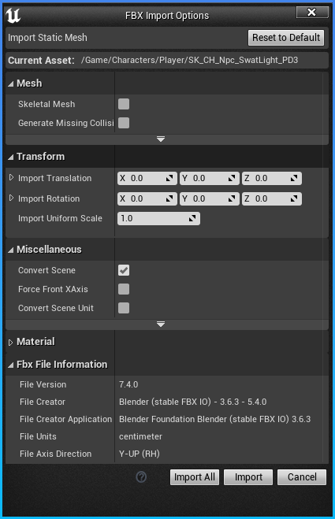

# Custom Static Model Replacements

## Prerequisites

 - Unreal Engine 4.27.2 is required
 - A program that can extract UE4 PAK files (FModel, UModel)
 - A program that can pack UE4 files (repak, UnrealPak)
 - Model editing program, such as Blender, Maya, 3ds Max... (needs to support .psk files)
 - Blender plugin for importing .psk files (https://github.com/matyalatte/blender3d_import_psk_psa)
 - Basic knowledge of PBR materials and texture packing

## Extracing models from game files - Introduction

For this, I will be using Fmodel, you can also use Umodel, however Fmodel is the easiest to work with and has better support. I will also be using Blender with the .psk addon.
It's exptected you have an idea how to use Blender and know basics of rigging.

### Using Fmodel

1. Open up Fmodel, go to Directory -> Selector, fill in the Directory field with the game's files location.
2. Input AES key in the Directory -> AES, input `0x27DFBADBB537388ACDE27A7C5F3EBC3721AF0AE0A7602D2D7F8A16548F37D394` in the Main Static Key field.
3. In Loading Mode select All, this will load all .pak files at once, giving you access to all game files.
4. Look for the file you want to replace, such as the Moneybag model `PAYDAY3/Content/Gameplay/Player/Props/Moneybag_01/Meshes`, you can also use Fmodel's search function (Packages -> Search)
5. Extract the model (Right click -> Save Model .psk), the exported file location will pop up in the Log window below, you can click the underlined text to open the asset's location.

### Using Blender

1. Import the .psk file you exported.
2. Rig the models accordingly if necessary, some models don't have a skeleton or vertex groups.
3. Add 3 addtional empty UV maps. (scale down until they're not visible)
4. Add an additional empty material assigned to a face, has to be first slot.
5. Export the model as .FBX with following settings:

### Importing in Unreal Engine

1. You will need to set up the correct project hierchary, using the Moneybags as example, the hierarchy is as follows: 
`Content/Gameplay/Player/Props/Moneybag_01`
2. Import the .FBX with these settings if you're importing a static mesh:

### Creating materials

1. We will be referencing already existing master material in the game.
2. Create project hierarchy:
`Content/MasterMaterial/Vehicles/Helicopter/MM_HelicopterInterior`
3. Create a Material, name it as following `MM_HelicopterInterior`
4. Set up the material as following:

5. Import your textures wherever you wish, they will need to have a specific packing in order to work.

### Packing textures

1. You can use either Substance Painter with an export preset or any image manipulation program.
2. Your texture should be packed as following:

`Albedo(RGB)Labels(A) = RGB - base color, alpha - emission mask`
`BaseNormal(RG)Roughness(B)Metallic(A) = 2-channel DirectX normal map, blue - rough, alpha - metal`

3. Set the Normal texture Compression Settings to Masks.

### Creating and assigning material instances

1. Create a material instance from the MM_HelicopterInterior material, put it wherever you wish.
2. Open up your model and assign material instances accordingly.

### Cooking and packing

There's a few ways to do this, I will cover the way I personally cook and pack my mods. You can also generate chunks and selectively choose what to pack. 

1. In Unreal Engine, go into File -> Cook Content for Windows. This will cook the content in `YourProjectName\Saved\Cooked`
2. Go in `YouProjectName\Saved\Cooked\WindowsNoEditor\YouProjectName` and copy the Content folder.
3. Paste the Content folder in a different location where your workfolder is located. (You should create some sort of a workfolder for organization, not necessary)
4. Create a folder called pakchunk99-Mods_YourModsName_P and paste in the Content folder you copied. (Mod names can differ, this is just how I personally name them, the `_P` is necessary)
5. Find the master material uasset (MM_HelicopterInterior.uasset) and don't cook/delete it.
6. Create the .pak file, you can either use UnrealPak, repak or other solutions.

### Testing it out

1. Put the .pak file in the game's Paks directory `PAYDAY3\PAYDAY3\Content\Paks` or the mods 
2. The model should now appear in-game if you've done everything correctly.

If you've got questions, feel free to contact me on Discord. (unselles)

# Custom Skeletal Model Replacements

WIP
