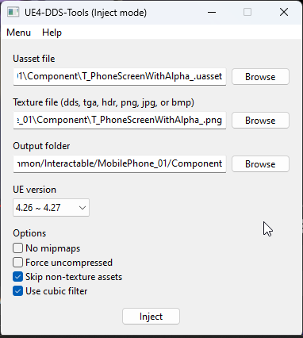
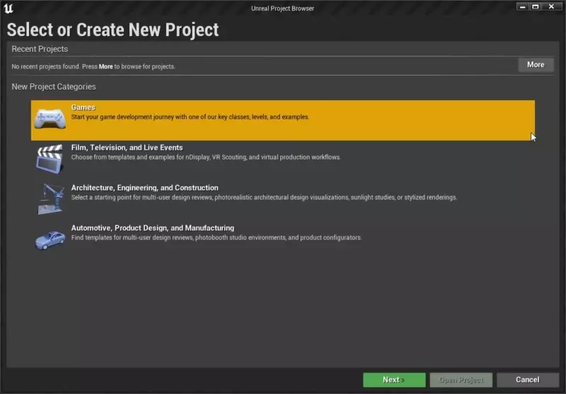
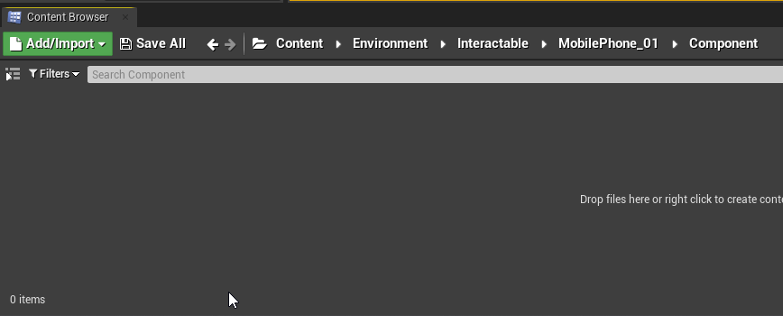
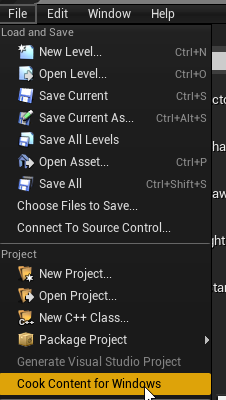
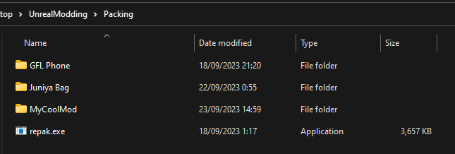

# Texture Replacements

Let's start with a simple texture replacement, understanding it will allow you to understand more complex asset replacements.

## Prerequisites
* [FModel](/docs/additional-resources/tools#fmodel)
* [Repak](/docs/additional-resources/tools#repak-by-truman)
* [DDSTools](/docs/additional-resources/tools#dds-tools) If you do not wish to install Unreal Engine.
* [Unreal Engine 4.27](https://www.unrealengine.com/en-US/download) If you plan to do more than simple asset replacements.

I recommend putting the tools in some directory like `Tools` before doing anything.

## Replacing
Find the texure you wish to replace, we'll replace the phone screen in this guide (`PAYDAY3/Content/Environment/_Common/Interactable/MobilePhone_01/Component/T_PhoneScreenWithAlpha_`). Go to the [Using FModel](/docs/basics/using-fmodel/) page to learn how.

Edit the texture's png file as you'd like.

There are a few different ways to replace assets, we'll focus on two for textures.

### Using DDS-Tools
*This method is mainly if you want to just replace a texture and not interested in any other asset types.*

For this method you will need to **additionally** export the raw asset. Do the same as [exporting the texture](/docs/basics/using-fmodel/#exporting), but this time click on `Export Raw Data (.uasset)`. You should now see 4 files:


Open DDS-Tools and do the following steps:
1. Point DDS-Tools to the uasset file (`T_PhoneScreenWithAlpha_.uasset` in our case)
2. Point DDS-Tools to the image file (`T_PhoneScreenWithAlpha_.png` in our case)
3. Set an output folder, I recommend setting it to `ToolsDirectory/ModName/PAYDAY3/Content/Environment/_Common/Interactable/MobilePhone_01/Component` for reasons you will see in the packing stage. (The path may be different depending on the texture you are replacing). `ToolsDirectory` is where you placed the tools you downloaded in the prerequisites stage.
4. Set UE version to `4.26 ~ 4.27`.


After that you should have something like this:



Click inject and you are ready for packing. The folder with the cooked texture should appear in the tools directory if you followed the recommendation.

### Using Unreal Engine
*This method is here mainly to show the simplest form of asset replacement that can be used for almost any type of asset.*

Open Unreal Engine and create a new project, **name it PAYDAY3**.


:::caution
In Unreal Engine, paths already begin from `Content`, therefore you need to ignore PAYDAY3/Content when working inside Unreal Engine.
:::

Go to `Content Browser`, right-click below and click on `New Folder` and replicate the directory structure of the asset you wish to replace.
So the end result should be like:



Now let's import our edited texture. The simplest way is to navigate to the directory and drag and drop your texture there.


Click `Save All` to ensure your files are saved.


Next step is to cook the files, simply click on `File` and then `Cook Content for Windows`



Once done, the cooked files should be in `Documents\Unreal Projects\PAYDAY3\Saved\Cooked\WindowsNoEditor\PAYDAY3\Content` (Your Unreal Projects directory may be different).
Copy the **folder** there into some folder with repak in it so that it's in `MyMod/PAYDAY3/Content/`.

## Packing
Packing is simple using Repak, however first you must make sure you replicate the pak path.
In our case, the path is `PAYDAY3/Content/Environment/_Common/Interactable/MobilePhone_01/Component`.
This is exactly how it should be before packing.

If you followed through the guide, the directory structure should look like so:


I recommend placing repak.exe where the mod folder is:


Hold shift and right click where repak.exe is, click on `Open PowerShell window here`. You will see a window popup.
To pack your mod execute the following command:
```ps
 ./repak pack ModName
```


:::tip
You can pack as many files as you'd like into a single package and do not need to repeat the process for each replacement you do.
:::

Your mod is now ready to be installed.

